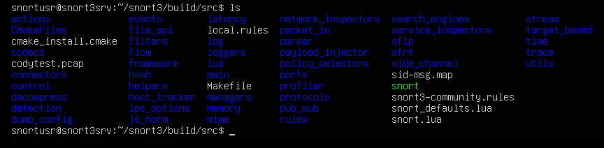

# Snort3 Installation Guide

### Foreword

 I got kind of annoyed by the guide on the snort website/github repo so I decided to make my own guide. This install makes use of `apt install` a lot instead of building software using `make` like the guides suggest. I found this to be a lot faster and easier when you can just use `apt` for almost everything and `make` only when required. If you would like to copy me exactly I am starting from a fresh Ubuntu 22.04 VM immediately after the installation, first reboot, and login. I am snortusr working from `~` or `/home/snortusr/` for all my `git clone` uses.


**TESTING DELETE THE BELOW**



```bash 
Do this with 
```

**TESTING DELETE THE ABOVE**

### Requirements Pre-Snort install

Start by checking for or installing the following, they are required for building some of the packages we need.

* **C++ 14 compatible compiler**
  
  `sudo apt install g++`
  
  * On my first attempt at installing Snort, I googled "C++ 14 compatible compiler" and manually installed GCC (some version above 11.4) as their site claims it is C++14 compatible (by the way I am not debating that fact. It is, in fact, compatible.... I'm sure it works just fine for other applications) but this did not work, as when I got to the snort3 build it failed for "missing c++ compiler" or similarly worded error. I then installed g++ and got past that error. In a second VM everything worked fine with only g++ installed and without any GCC installation.

* **cmake**
  
  `sudo apt install cmake`

* **git**
  
  `sudo apt install git`

### Main Snort requirements

* **dnet**
  
  `sudo apt install libdumbnet-dev`
  
  * "But why is it called lib**dumb**net and not just lib**d**net ?"
  
  * Not sure why they chose "dumb" but libdnet is apparently a legacy library in Debian so they changed the name of the libdnet package we're using to libdumbnet.

* **hwloc**
  
  `sudo apt install libhwloc-dev`
  
  * Does not work with `sudo apt install hwloc`

* **OpenSSL**
  
  * Even if you already have OpenSSL installed, it doesn't count for our purposes.
    
    * `apt list --installed | grep "open*"` will show current installations
  
  `sudo apt install libssl-dev` to install the proper package

* **bison**
  
  `sudo apt install bison`
- **flex**
  
  `sudo apt install flex`
* **pcap**
  
  * Requires **bison** and **flex** before it can be installed
  
  ```bash
  cd ~ # Or your location of choice
  # Clone the repository
  git clone https://github.com/the-tcpdump-group/libpcap.git
  # Enter the new folder
  cd libpcap
  # Since we cloned from github, we have to run autogen before configure
  ./autogen.sh
  ./configure --prefix=/usr/local
  # Now we can make and make install
  make
  sudo make install
  ```

* **pcre**
  
  `sudo apt install libpcre3-dev`

* **pkg-config**
  
  `sudo apt install pkg-config`

* **zlib**
  
  `sudo apt install zlib1g-dev`
  
  * If you try typing `zlib` into the terminal before installing the above, you can see zlib is installed by default. This doesn't matter as snort is very particular. Funny enough, this Stackoverflow  post is downvoted three times but it absolutely solved my problem when building snort3 returned "could NOT find zlib."
    
    * [ubuntu 18.04 - Could NOT find ZLIB (missing: ZLIB_LIBRARY) (found version &quot;1.2.11&quot;) - Stack Overflow](https://stackoverflow.com/questions/54923690/could-not-find-zlib-missing-zlib-library-found-version-1-2-11)

* **libtool**
  
  `sudo apt install libtool`
  
  * Was already installed on mine, I believe from a package leading up to pcap

* **libunwind**
  
  `sudo apt install libunwind-dev`
  
  * The docs say this is an optional package, but either libdaq or snort3 wouldn't build without it

* **LuaJIT**
  
  ```bash
  cd ~ #or whatever dir you chose for libpcap
  
  git clone https://luajit.org/git/luajit.git
  
  cd luajit
  
  make && sudo make install
  ```

Installing LibDAQ

* Start by downloading and configuring LibDAQ git files
  
  ```bash
  cd ~ # or whatever dir you chose for libpcap and LuaJIT
  git clone https://github.com/snort3/libdaq.git
  cd libdaq
  ./bootstrap
  ./configure` # don't do the prefix like implied in the docs, it will break everything
  make install # I had to use sudo for this to work properly
  ```
  
  

* Now run ldconfig to bind everything together
  
  * If it worked properly you will not see any messages appear. For example:
  
  ```bash
  snortusr@snort3srv:~/snort3/build/src$ sudo ldconfig
  snortusr@snort3srv:~/snort3/build/src$
  ```
  
  

Installing Snort

* Start by downloading and configuring the Snort3 git repository
  
  * `cd ~` or whatever dir you chose for libdaq, libpcap, and luajit
  
  * `git clone https://github.com/snort3/snort3.git`
  
  * `cd snort3`
  
  * `./configure_cmake.sh` Don't use prefix unless you really need to, defaults are fine
  
  * `cd build` 
  
  * `make -j $(nproc)`
  
  * `sudo make install`

* Test the new Snort installation
  
  * `cd src` while still in the `/somedir/snort3/build` directory
  
  * `./snort -v`

Using Snort

* Some snort commands seem to require sudo
  
  * In this case, use the full path to call snort. For me it would be:
    
    * `sudo /home/snortusr/snort3/build/src/snort -commands options`

* Using community rules
  
  * `curl -L https://snort.org/downloads/community/snort3-community-rules.tar.gz > rules.tar.gz`
  
  * `tar xvf rules.tar.gz`
    
    * This gives you `sid-msg.map` and `snort3-community.rules` which we can now move into our somedir/snort3/build/src/ folder
      
      * `sudo mv sid-msg.map /somedir/snort3/build/src/sid-msg.map`
      
      * `sudo mv snort3-community.rules /somedir/snort3/build/src/snort3-community.rules`
  
  * Now we look for snort.lua
